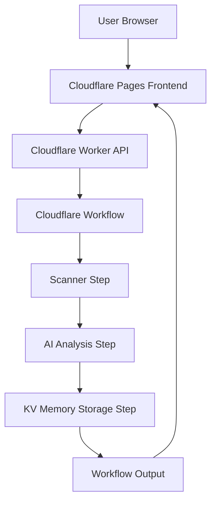

# cf_ai_edgeguard Architecture

## Overview

`cf_ai_edgeguard` is a Cloudflare-native system that analyzes website security posture and edge performance using workflow orchestration and LLM reasoning.

## Architecture Diagram

## Components

- **Frontend (Cloudflare Pages)**
  - React + TypeScript + Vite + TailwindCSS dashboard.
  - Sends `POST /analyze` and polls `GET /result?id=<workflowId>`.

- **Worker API (Cloudflare Workers)**
  - Exposes REST endpoints.
  - Starts workflow instances and returns workflow status/output.

- **Workflow Engine (Cloudflare Workflows)**
  - Runs deterministic multi-step analysis.
  - Handles caching short-circuit before expensive operations.

- **Scanner Module**
  - Fetches website, measures latency, inspects security headers.

- **AI Module**
  - Uses Workers AI first (`@cf/meta/llama-3.1-8b-instruct`).
  - Falls back to Gemini (`GEMINI_API_KEY`) when Workers AI is unavailable.

- **Memory Module (KV)**
  - Stores analysis by normalized URL key.
  - Returns cached results for repeated requests.

## Data Flow

1. User submits URL from frontend.
2. Worker creates workflow instance.
3. Workflow checks KV cache.
4. If no cache, scanner collects headers/latency/status.
5. LLM generates structured risk/performance report.
6. Result is written to KV and returned by workflow.
7. Frontend polls workflow result and renders dashboard.
